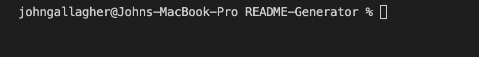
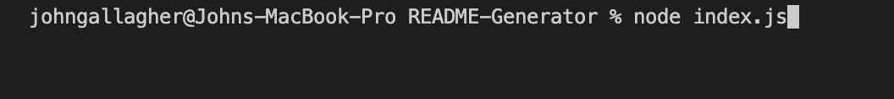
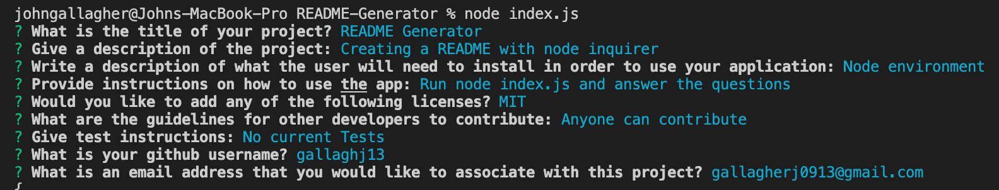

# README Generator

## Description

I created a README.md generator using node.js. This application allows the user to answer a set of questions, and have the answers added to a README file for their project. I learned how to use node and the inquirer package. 

## License:  

## Table of Contents
1. [Description](#description)
2. [Installation](#installation)
3. [Usage](#usage)
4. [Credits](#credits)
5. [Contributing](#contributing)
6. [License](#license)
7. [Questions](#questions)

## Installation

In order for this application to work you will need the node environment installed on your computer. Adequate instructions for downloading the environment can be found at nodejs.org. The inquirer package is also used in this application. To install the inquirer run npm install inquirer.

## Usage
1. Go to the terminal and make sure you are in the folder that contains index.js

2. Run node index.js in the terminal

3. You will be prompted with a series of questions about your project

4. Once all of the questions have been answered the console should say "Successfully created README file"
5. In this application the README will be generated with the name SAMPLEREADME

## Credits

- MDN Web Docs
- Tutor: Aaron Centeno
- npmjs.com
- VSCode
- StackOverflow

## Contributing

  
For contributing guidelines see link : https://www.contributor-covenant.org/

## License 
This Project is licensed under the MIT license.

* https://opensource.org/licenses/MIT

## Questions

Follow link for github: [Github Profile] (https://github.com/gallaghj13)  
For any additional questions you can reach me at: gallagherj0913@gmail.com
